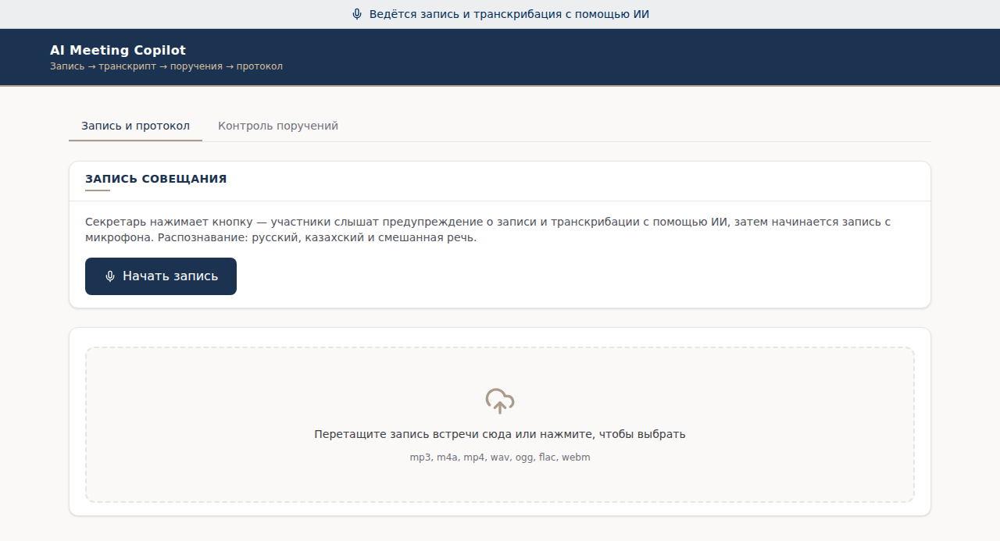
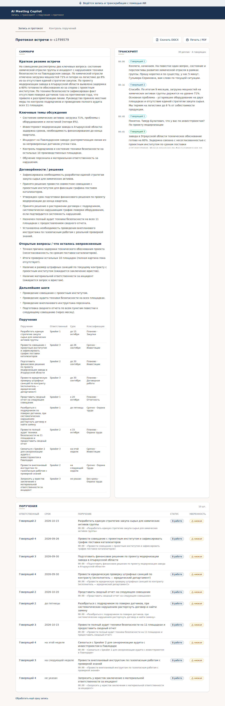
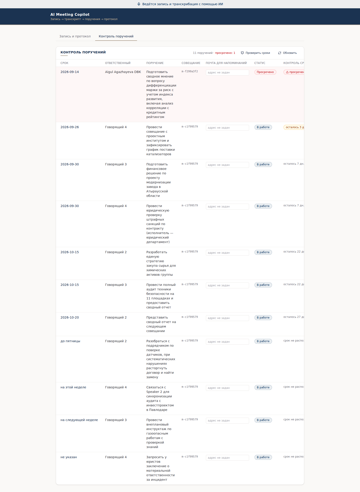

# Руководство пользователя

AI Meeting Copilot превращает запись совещания в протокол: транскрипт по говорящим,
список поручений с ответственными и сроками, саммари и выгрузку в DOCX или PDF.

Открыть: **https://app.aibots.kz** — разворачивать ничего не нужно.

---

## С чего начать



Два пути получить запись. **Начать запись** пишет совещание прямо в браузере: перед
началом участникам проигрывается предупреждение о том, что ведётся запись и транскрибация
с помощью ИИ — сначала на казахском, потом на русском. Это требование Сценария 1 из
постановки задачи, и оно выполняется голосом, а не мелким шрифтом.

**Зона загрузки** принимает готовый файл: `mp3`, `m4a`, `mp4`, `wav`, `ogg`, `flac`, `webm`.
Можно перетащить мышью или нажать и выбрать.

Плашка сверху висит на всех экранах, пока идёт работа с записью.

---

## Субтитры Zoom: откуда берутся имена

После выбора записи под именем файла появляется строка **«Приложить .vtt»**. Субтитры
необязательны, но меняют результат заметно.

| | В протоколе |
|---|---|
| Запись без субтитров | «Говорящий 1», «Говорящий 2» — голоса различаются, имена неизвестны |
| Запись с субтитрами Zoom | настоящие фамилии участников в транскрипте и в поручениях |

Разница не косметическая. Диаризующая модель различает **ровно четыре голоса**: на совещании
из шести человек два участника неизбежно сольются в один ярлык. Субтитры этот потолок
обходят — имена берутся из них, а не из акустики.

Файл кладётся рядом с записью; система сама находит его и подставляет. В зону загрузки
можно уронить сразу пару «запись + субтитры» — они разберутся по расширению.

---

## Пока идёт обработка

На экране обработки видно, какой шаг выполняется, и сколько времени прошло. Запись
4 мин 34 с проходит путь целиком примерно за минуту: распознавание, диаризация, разбор
транскрипта.

**Страницу можно обновить или закрыть вкладку.** Браузер помнит, какая встреча в работе,
и после возвращения показывает тот же экран, а таймер продолжает считать от начала
обработки. Конвейер работает на сервере и от вашей вкладки не зависит.

Длинные записи режутся на куски по десять минут и склеиваются обратно — часовое совещание
обрабатывается так же, как короткое, просто дольше.

---

## Протокол



**Саммари** — краткое содержание: о чём договорились, что осталось открытым, какие
дальнейшие шаги.

**Транскрипт** — реплики с таймкодами и говорящими. Ярлыки условны и устойчивы только
внутри одной записи: «Говорящий 1» в двух разных файлах — это, вообще говоря, разные люди.

**Поручения** — таблица с ответственным, сроком, сутью и классификацией по срочности и
направлению («Срочно · Договорная работа»). Словесные сроки переводятся в даты: «до
15 октября» становится `2026-10-15`. Если срок назван неопределённо — «до пятницы», «на
этой неделе», — он остаётся как сказано, и система это показывает, а не выдумывает дату.

Столбец **уверенность** — честная пометка. `низкая` означает, что ответственный определён
ярлыком говорящего, а не именем: привязка к конкретному человеку не подтверждена.
С субтитрами Zoom уверенность высокая.

**Скачать DOCX** и **Печать / PDF** выгружают протокол файлом. Печать открывает системный
диалог, откуда можно сохранить в PDF.

---

## Контроль поручений и напоминания



Вкладка собирает поручения **всех** совещаний. Просроченные идут первыми, с красной
подложкой; те, у кого срок на подходе, помечены жёлтым. Список переживает перезапуск —
он хранится в объектном хранилище, а не в памяти.

Впишите **почту ответственного** в его строке: в записи совещания адресов нет, поэтому
это единственное, что вводится руками. Адрес сохраняется сразу.

**«Проверить сроки»** запускает рассылку. Напоминание уходит за три дня до срока и
отдельно при просрочке — по одному разу на каждый повод, повторов не будет. Под шапкой
появляется строка с итогом: сколько отправлено, сколько записано в журнал.

Кнопка **«выполнено»** в правой колонке закрывает поручение — по нему напоминания больше
не приходят.

> **Отправка писем в демо-версии не настроена.** Письма формируются и складываются в
> журнал с пометкой «не отправлено», и в интерфейсе видно, кому и что ушло бы. Чтобы они
> уходили по-настоящему, задайте `MAIL_API_URL`, `MAIL_API_KEY` и `MAIL_FROM` — подходит
> любой провайдер, принимающий POST: Resend, Mailgun, Postmark, MailChannels. Подробнее —
> в [README](../README.md#сценарий-2--контроль-сроков-и-напоминания).

Проверку сроков можно повесить на внешний планировщик, чтобы напоминания уходили сами:

```bash
curl -X POST https://app.aibots.kz/api/commitments/notify
```

---

## Что система про себя знает и говорит честно

- **Имена без субтитров не определяются.** Ставятся ярлыки, и уверенность помечается низкой.
- **Диаризация различает четыре голоса.** Пятый участник сливается с одним из четырёх; это
  устройство модели, а не настройка.
- **Смешанная речь распознаётся хуже одноязычной.** Замер на публичном корпусе: CER 0.0511
  против 0.000 на чистом казахском. Ошибки собираются на стыке языков, внутри фраз их мало.
- **Неопределённые сроки остаются словами.** «До пятницы» не превращается в дату наугад.

Полный список ограничений и методика замеров — в [README](../README.md#ограничения).
